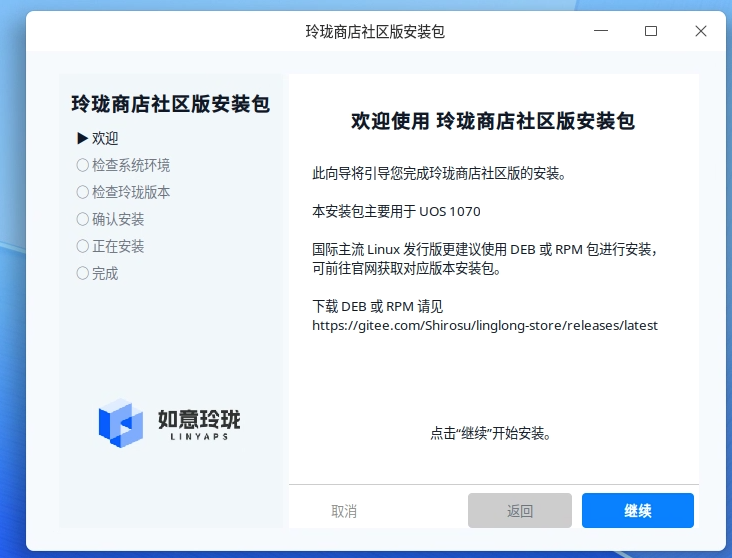

# Linglong Installer

Linglong Installer 是基于 `go-pkg-installer` 框架构建的玲珑商店社区版安装器。
它通过读取 `installer.yaml` 来驱动安装流程，自动识别发行版、检查玲珑版本，
并执行对应发行版的安装脚本与后续配置。
## 截图

## 项目特点

- 配置驱动：安装流程、界面与任务通过 `installer.yaml` 描述。
- 发行版适配：根据 `/etc/os-release` 选择 `scripts/distros` 中的脚本。
- 双模式运行：支持 GUI 与 Headless/CLI 模式。
- 资源内嵌：默认内嵌 `installer.yaml`、logo 与脚本，便于打包发布。

## 目录结构

- `installer.yaml`: 安装器核心配置，定义流程与页面。
- `main.go`: 启动入口，加载配置、构建流程、选择 GUI/CLI 模式。
- `task_distro_script.go`: 自定义任务，解析发行版脚本与 META 信息。
- `screen_linglong_version.go`: 玲珑版本检查页面。
- `scripts/common.sh`: 发行版脚本共享逻辑。
- `scripts/distros/*.sh`: 各发行版安装脚本（ID_VERSION 命名）。
- `scripts/user/*.sh`: 安装商店与 DBus 配置脚本。
- `assets/logo.png`: 安装器 logo。

## installer.yaml 执行流程

`installer.yaml` 的 `flows.install` 定义了完整安装流程，入口为 `welcome`：

1. `welcome`：欢迎页，说明安装器适用范围与下载方式。
2. `detect`：系统检测页，展示发行版信息，守卫条件要求 `distro.supported=true`。
3. `linglong_version`：检测玲珑版本，读取 `linglong.min_version` 并提示升级。
4. `confirm`：确认页，展示发行版信息、脚本 META 提示、即将执行的命令等。
5. `install`：执行安装任务：
   - `${distro.script}` 发行版安装脚本
   - `${linyaps.store.setup_script}` 安装玲珑商店
   - `${linyaps.dbus.setup_script}` 配置用户级 DBus 服务
6. `finish`：完成页。

关键上下文变量由 `distroScript` 任务写入，并在页面中通过 `${...}` 渲染：

- `distro.id` / `distro.version` / `distro.name`
- `distro.supported` / `distro.error`
- `distro.script` / `distro.script_name`
- `distro.repo_name` / `distro.repo_url`
- `distro.next_steps` / `distro.commands`

## 发行版脚本与 META 说明

每个发行版脚本以 `ID_VERSION.sh` 命名，例如 `debian_13.sh`。
脚本头部可包含 `# META:` 行，供确认页展示：

```
# META: repo_name=Linglong CI Release (Debian 13)
# META: repo_url=https://example.com/repo/
# META: command=apt update
# META: command=apt install -y linglong-bin
# META: next_steps=Add Linglong repo and install required packages.
```

META 仅用于展示，实际执行逻辑由脚本内容决定。

## 运行方式

使用内嵌配置运行：

```
go run ./
```

指定外部配置运行：

```
go run ./ --config installer.yaml
```

Headless 模式：

```
go run ./ --headless
```

## 版本检查页面

`screen_linglong_version.go` 通过 `ll-cli --version` 解析玲珑版本，
若低于 `linglong.min_version`，会提示是否立即更新。

## 资源内嵌

`embed.go` 内嵌了：

- `installer.yaml`
- `assets/logo.png`
- `scripts/common.sh`、`scripts/distros/*.sh`、`scripts/user/*.sh`

当本地找不到脚本时，会自动从内嵌资源释放到临时目录执行。

